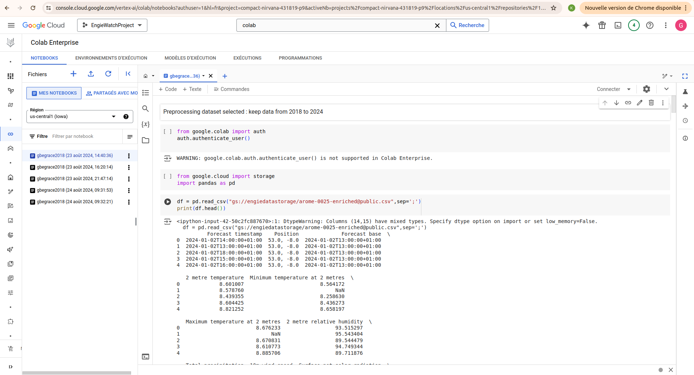
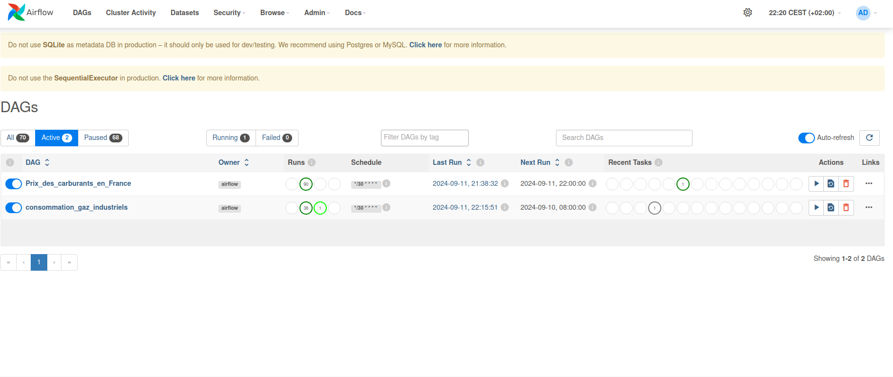
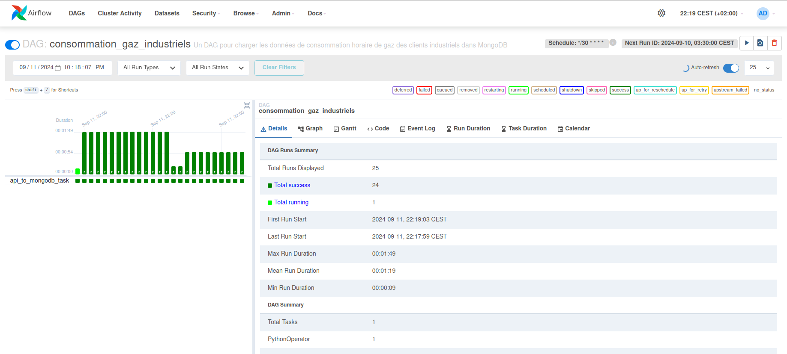
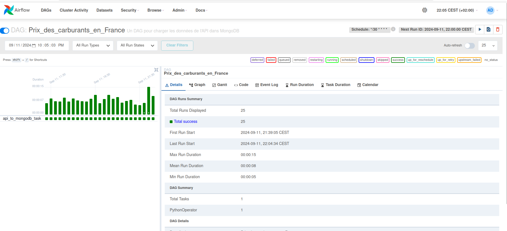

# 🚀 Détection d'Anomalies dans la Consommation d'Énergie

### Langage

### Frameworks et Outils de Développement

### Machine Learning & Data Science

### Cloud & Stockage

### CI/CD et Outils de Débogage

## 📑 Sommaire
1. [🔍 Contexte du Projet](#contexte-du-projet)
2. [🎯 Pourquoi ce projet ?](#pourquoi-ce-projet)
3. [🎯 Objectifs du Projet](#objectifs-du-projet)
4. [🏗️ Architecture du Projet](#architecture-du-projet)
5. [⚙️ Intégration Continue (CI) et Tests Unitaires](#intégration-continue-ci-et-tests-unitaires)
6. [📂 Structure du Projet](#structure-du-projet)
7. [🔄 Pipelines de Collecte de Données avec Kedro](#pipelines-de-collecte-de-données-avec-kedro)
8. [💻 Traitement des Données et Utilisation de Google Colab](#traitement-des-données-et-utilisation-de-google-colab)
9. [🤖 Modèles de Machine Learning](#modèles-de-machine-learning)
10. [🖥️ Interface Utilisateur avec Streamlit](#interface-utilisateur-avec-streamlit)
11. [📊 Ordonnancement des Données avec Airflow](#ordonnancement-des-données-avec-airflow)
12. [📜 Conclusion](#conclusion)
13. [⚠️ Difficultés Rencontrées](#difficultés_rencontrées)
14. [🚀 Prochaines Étapes : Phase 2 - Forecasting ](#prochaine_etapes)

## 1. 🔍 Contexte du Projet
La détection précoce des anomalies énergétiques est essentielle pour la gestion proactive de l'énergie, en particulier pendant les périodes de forte demande (hiver, été) ou durant des événements comme les mouvements sociaux. Ce projet vise à identifier ces anomalies en se basant sur des données variées (météorologiques, sociales, etc.) et à fournir une interface utilisateur permettant la visualisation et l'analyse des résultats. La solution est structurée en plusieurs sous-projets interconnectés, chacun avec des objectifs spécifiques.

## 2. 🎯 Pourquoi ce projet ? 
Nous avons identifié plusieurs défis majeurs dans la gestion énergétique :
- **Surconsommation en Hiver et en Été** : Augmentation significative de la demande en électricité pendant les périodes de froid ou de chaleur extrême.
- **Jours Fériés et Mouvements Sociaux** : Les variations imprévues dans la consommation peuvent déséquilibrer l'offre et la demande.

Nos cibles principales incluent :
- **Entreprises d'Électricité** (comme Engie et EDF) qui doivent surveiller la consommation en temps réel et ajuster leur production.
- **Industries à Forte Consommation** qui nécessitent une gestion optimale de leur énergie pour éviter des interruptions.

## 3. 🎯 Objectifs du Projet 
Notre projet se concentre sur six grands objectifs :
1. **🔍 Détection des Anomalies** : Identifier en temps réel les anomalies de consommation et les cyberattaques potentielles.
2. **📈 Prédiction des Incidents** : Utiliser des modèles prédictifs pour anticiper les risques futurs.
3. **⚡ Optimisation des Ressources** : Aider les entreprises à optimiser leur consommation énergétique.
4. **🔄 Amélioration Continue** : Intégrer les retours des utilisateurs pour perfectionner notre système.
5. **🌍 Réduction de l'Empreinte Carbone** : Calculer l'impact carbone de nos serveurs et de nos traitements de données.
6. **📅 Prévision et Planification** : Utiliser des séries temporelles pour prédire les besoins futurs en énergie.

## 4. 🏗️ Architecture du Projet 
Le projet est divisé en plusieurs modules interconnectés, chacun jouant un rôle clé dans l'ensemble du système.

- **🛠️ Module Collecte et Stockage des Données**
- **🛠️ Module Traitement, Stockage et Visualisation**
- **🛠️ Module Entraînement et Suivi des Modèles**
- **🛠️ Module Déploiement et Feedback**
- **🛠️ Module d'Orchestration et Conteneurisation**
- **🛠️ Module Intégration Continue (CI) et Tests Unitaires**

## 5. ⚙️ Intégration Continue (CI) et Tests Unitaires 
Nous avons mis en place une CI via GitHub Actions, qui exécute des tests unitaires pour chaque sous-projet à chaque commit.

### Outils utilisés pour la CI :
- **🧪 Pytest** pour les tests unitaires
- **🔍 Pylint, Black, Mypy** pour l'analyse statique et le formatage du code
- **📊 Coverage** pour mesurer la couverture des tests

Le pipeline de CI est disponible dans le répertoire `.github/workflows`.

Chaque module du projet est containerisé avec Docker pour garantir la portabilité et la cohérence des environnements. Les fichiers `.env` sont utilisés pour configurer les variables d'environnement de manière flexible.

## 6. 📂 Structure du Projet 
(Insérer la structure détaillée du projet ici)

Nous utilisons un **🛠️ Makefile** pour automatiser les processus de build, de tests et faciliter la gestion de la CI locale.

## 7. 🔄 Pipelines de Collecte de Données avec Kedro 
Cette partie est un sous projet développer pour la partie ingestion des données est inclus dans notre projet de détection d'anomalie .
Deux pipelines Kedro ont été mis en place :
1. **Pipeline ETL** : Ce pipeline collecte, transforme et stocke les données dans MongoDB.
2. **Pipeline d'Enrichissement** : Ce pipeline charge les données, les fusionne et les stocke dans Elasticsearch.

Pour accéder à ce sous projet et àvoir plus de détails, consultez le [README de la partie Kedro](https://github.com/keagnon/DetectionAnomalie/blob/grace_clustering_mvt/data-collection-kedro/README.md).

## 8. 💻 Traitement des Données et Utilisation de Google Colab 
Certaines données volumineuses ont été traitées avec **Google Colab**, notamment pour les membres de l'équipe ayant des limitations matérielles. Voici une capture d'écran de nos notebooks sur Google Colab ainsi que notre bucket GCP pour le stockage des données et artefacts. Nous

 utilisons MLflow pour le tracking de nos modèles :

## 9. 🤖 Modèles de Machine Learning 
Les données ont été divisées en deux groupes :
1. **Consommation journalière par région avec données météorologiques**.
2. **Consommation journalière et mouvements sociaux** (avec une colonne "mouvement social" indiquant les jours avec des événements).

Ces deux groupes de données ont conduit à deux sous-projets distincts :
- [Sous-projet sur la consommation régionale et les données météo](lien_readme_conso_meteo).
- [Sous-projet sur la consommation et les mouvements sociaux](https://github.com/keagnon/DetectionAnomalie/blob/grace_clustering_mvt/ml_models/mouvements_consommation/Readme.md).

Ces sous-projets, ainsi que notre interface Streamlit, utilisent **MLflow** pour le suivi et la mise en production des modèles. Un serveur **MLFlow** a été déployé sur une VM GCP pour permettre à l'équipe de suivre les performances des modèles.

## 10. 🖥️ Interface Utilisateur avec Streamlit 
L'interface utilisateur finale a été développée avec **Streamlit**. Elle permet :
- Le téléchargement de datasets.
- La visualisation des résultats des modèles de machine learning.
- La collecte de feedbacks utilisateurs.

Cette interface est un sous projet de notre projet de détection d'anomalie.Il est déployée localement et sur **Streamlit Community**. Pour accéder à ce sous projet et avoir plus de détails,cliquer sur [README de l’interface Streamlit](https://github.com/keagnon/DetectionAnomalie/blob/grace_clustering_mvt/dashboard_ui/Readme.md).

## 11. 📊 Ordonnancement des Données avec Airflow 
Nous avons documenté plusieurs étapes critiques du projet :
1. **Mise en place d’un serveur MLFlow sur GCP** : [documentation_mlflow](https://github.com/keagnon/DetectionAnomalie/blob/grace_clustering_mvt/documentation/etapes_mise_en_place.pdf)
2. **Mise en place d’un serveur Airflow en local** : [documentation_airflow](https://github.com/keagnon/DetectionAnomalie/blob/grace_clustering_mvt/documentation/etapes_installation_airflow.txt)
3. **Ordonnancement des Données avec Airflow** : [documentation_airflow](https://github.com/keagnon/DetectionAnomalie/blob/grace_clustering_mvt/documentation/Ordonnoncements_donn%C3%A9es.pdf)

**Airflow** est utilisé pour orchestrer les pipelines de collecte de données via des DAGs. Un exemple de DAG est utilisé pour enrichir nos datasets avec des données d'API. Ce script Airflow s'exécute chaque jour à 20h pour une durée de 30 minutes. Voici des images de notre DAG et de notre interface Airflow :

## 12. 📜 Conclusion 
Le projet de détection d'anomalies dans la consommation d'énergie a permis de mettre en place une solution complète, modulaire et scalable. Grâce à l'intégration de diverses technologies comme Kedro, MLflow, Elasticsearch, et Streamlit, nous avons réussi à développer un système robuste capable d'identifier des anomalies dans les données de consommation énergétique. En combinant des données météorologiques, sociales et de consommation, nous avons pu générer des insights précieux qui aident les entreprises à optimiser leur utilisation d'énergie.

## 13. ⚠️ Difficultés Rencontrées 
Malgré les succès obtenus, plusieurs défis ont été rencontrés au cours du projet :
- **Traitement de Données Volumineuses** : Gérer et traiter des datasets volumineux, en particulier ceux des prévisions météorologiques et des mouvements sociaux, a posé des problèmes de performance sur certaines machines locales. L'utilisation de Google Colab et GCP a permis de pallier ces limitations. Lors de la collecte des données avec Kedro, nous avons été obligés de stocker les données par lots (batch size) pour pallier ces contraintes, et même après la fusion des données, nous avons dû insérer les données fusionnées dans Elasticsearch par petits morceaux (chunks).
- **Intégration de Technologies Diverses** : Le projet a nécessité l'intégration de plusieurs outils et frameworks (Kedro, MLflow, Docker, Elasticsearch), ce qui a parfois entraîné des difficultés de compatibilité et de gestion des dépendances. La mise en place du serveur MLflow a également posé des défis techniques.
- **Disponibilité des Données** : Nous avons dû collecter des données provenant de différentes sources, comme des fichiers PDF, des captures d'écran, et des fichiers XML, pour créer un dataset complet. Cela a entraîné des difficultés lors de la fusion des données, car certaines dates ne correspondaient pas, et nous étions en manque réel de données pour certaines périodes.
- **Problèmes de Budget** : Le manque de crédits GCP a également été un obstacle majeur, car certaines solutions étaient déployées sur des environnements "on-premise", ce qui a limité l'ampleur de nos expérimentations.

## 14. 🚀 Prochaines Étapes : Phase 2 - Forecasting 
La prochaine étape du projet est de passer à la **Phase 2 : Forecasting**. Nous avons pour objectif d'étendre le système actuel pour inclure des modèles de prévision basés sur des séries temporelles, afin d'anticiper les incidents futurs en se basant sur des données historiques et actuelles.

### Objectifs de la Phase 2 :
- **Prédiction des Risques d'Incidents** : Prédire les risques d'incidents sur une période de 2 à 3 mois.
- **Anticipation des Impacts** : Anticiper les impacts des conditions météorologiques et des événements sociaux sur la consommation énergétique.
- **Optimisation de la Planification** : Aider les entreprises à planifier et à ajuster leurs stratégies en fonction des prévisions.

### Détails :
Nous avons déjà réalisé un Proof of Concept (PoC), et l'objectif sera de rendre le système capable d'effectuer des prévisions précises et pertinentes. En combinant les données de séries temporelles avec les informations sur la consommation et les événements extérieurs, nous pourrons proposer des prévisions plus précises aux entreprises pour les aider à optimiser leurs ressources et éviter les incidents énergétiques.

Le système actuel est conçu de manière modulaire, ce qui permettra une transition fluide vers cette phase de forecasting et facilitera l'adaptation continue aux besoins changeants des entreprises et du marché.
