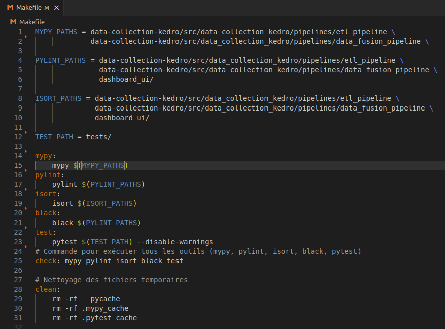
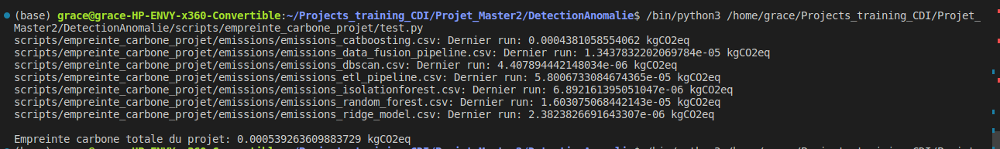
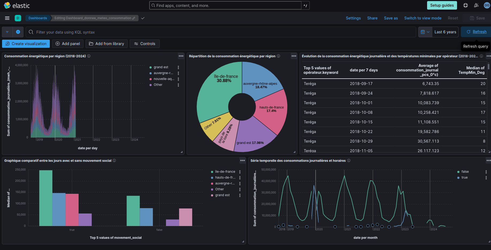
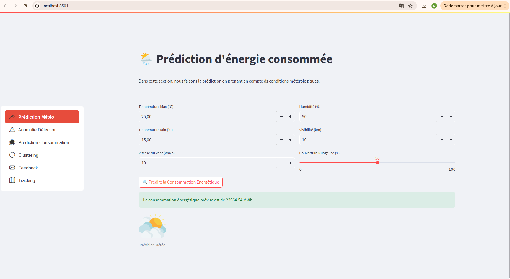

# 🚀 Détection d'Anomalies dans la Consommation d'Énergie

### Langage


### Frameworks et Outils de Développement


### Empreinte Carbone


### Machine Learning & Data Science


### Cloud & Stockage


### CI/CD et Outils de Débogage


### Librairies pour les Logs


## 📑 Sommaire
1. [🔍 Contexte du Projet](#contexte-du-projet)
2. [💡 Pourquoi ce projet ?](#pourquoi-ce-projet)
3. [🎯 Objectifs du Projet](#objectifs-du-projet)
4. [🏹 Nos cibles](#cibles)
5. [🏗️ Architecture du Projet](#architecture-du-projet)
6. [⚙️ Intégration Continue (CI) et Tests Unitaires](#intégration-continue-ci-et-tests-unitaires)
7. [🌍 Calcul de l'Empreinte Carbone du Projet](#co2)
8. [📂 Structure du Projet](#structure-du-projet)
9. [🔄 Pipelines de Collecte de Données avec Kedro](#pipelines-de-collecte-de-données-avec-kedro)
10. [💻 Traitement des Données et Utilisation de Google Colab](#traitement-des-données-et-utilisation-de-google-colab)
11. [🤖 Modèles de Machine Learning](#modèles-de-machine-learning)
12. [🖥️ Interface Utilisateur](#interface-utilisateur-avec-streamlit)
13. [📈 Monitoring des Logs et Performance](#monitoring-des-logs)
14. [📊 Documentation](#documentation)
15. [📜 Conclusion](#conclusion)
16. [⚠️ Difficultés Rencontrées](#difficultés_rencontrées)
17. [🚀 Prochaines Étapes : Phase 2 - Forecasting ](#prochaine_etapes)
17. [🤝 Notre Équipe](#equipe)

## 1. 🔍 Contexte du Projet<a name="contexte-du-projet"></a>
La détection précoce des anomalies énergétiques est essentielle pour la gestion proactive de l'énergie, en particulier pendant les périodes de forte demande (hiver, été) ou durant des événements comme les mouvements sociaux. Ce projet vise à identifier ces anomalies en se basant sur des données variées (météorologiques, sociales, etc.) et à fournir une interface utilisateur permettant la visualisation et l'analyse des résultats. La solution est structurée en quatre sous-projets interconnectés, chacun ayant des objectifs spécifiques et incluant un ou plusieurs modules.


## 2. 💡 Pourquoi ce projet ? <a name="pourquoi-ce-projet"></a>
Nous avons identifié plusieurs défis majeurs dans la gestion énergétique :
- **Surconsommation en Hiver et en Été** : Augmentation significative de la demande en électricité pendant les périodes de froid ou de chaleur extrême.
- **Jours Fériés et Mouvements Sociaux** : Les variations imprévues dans la consommation peuvent déséquilibrer l'offre et la demande.

## 3. 🏹 Nos cibles<a name="cibles"></a>
Nos cibles principales incluent :
- **Entreprises d'Électricité** (comme Engie et EDF) qui doivent surveiller la consommation en temps réel et ajuster leur production.
- **Industries à Forte Consommation** qui nécessitent une gestion optimale de leur énergie pour éviter des interruptions.

## 4. 🎯 Objectifs du Projet <a name="objectifs-du-projet"></a>
Notre projet se concentre sur six grands objectifs :
1. **🔍 Détection des Anomalies** : Identifier en temps réel les anomalies de consommation.
2. **📈 Prédiction de la consommation** : Utiliser des modèles prédictifs pour prédire la consommation.
3. **⚡ Optimisation des Ressources** : Aider les entreprises à optimiser leur consommation énergétique.
4. **🔄 Amélioration Continue** : Intégrer les retours des utilisateurs pour perfectionner notre système.
5. **🌍 Réduction de l'Empreinte Carbone** : Calculer l'impact carbone de nos serveurs et de nos traitements de données.

## 5. 🏗️ Architecture du Projet <a name="architecture-du-projet"></a>
Le projet est divisé en plusieurs modules interconnectés, chacun jouant un rôle clé dans l'ensemble du système.

- **🛠️ Module Collecte et Stockage des Données**
- **🛠️ Module Traitement, Stockage et Visualisation**
- **🛠️ Module Entraînement et Suivi des Modèles**
- **🛠️ Module Déploiement et Feedback**
- **🛠️ Module d'Orchestration et Conteneurisation**
- **🛠️ Module Intégration Continue (CI) et Tests Unitaires**
- **🛠️ Module Surveillance des logs**


## 6. ⚙️ Intégration Continue (CI) et Tests Unitaires <a name="intégration-continue-ci-et-tests-unitaires"></a>
Nous avons mis en place une intégration continue (CI) via **GitHub Actions**, qui exécute des tests unitaires et des analyses statiques à chaque commit sur les différents sous-projets.

### Outils utilisés pour la CI :
- **🧪 Pytest** pour l'exécution des tests unitaires.
- **🔍 Pylint, Black, Mypy** pour l'analyse statique du code et le respect des conventions de style. Nous avons obtenu un score de **10/10 sur Pylint**, garantissant un code de haute qualité.
- **📊 Coverage** pour mesurer la couverture des tests, avec un rapport généré après chaque exécution de CI afin d'assurer que l'ensemble du code est bien couvert par les tests.

Le pipeline de CI, configuré dans le répertoire `.github/workflows`, est accessible via [ce lien](https://github.com/keagnon/DetectionAnomalie/actions/runs/10871125104/job/30164567486).

Nous utilisons un **🛠️ Makefile** pour automatiser les processus de build, de tests et faciliter la gestion de la CI en local. Voici un aperçu de notre fichier `Makefile` :


En outre, chaque module du projet est containerisé avec **Docker** pour assurer la portabilité et la cohérence des environnements. Les fichiers `.env` permettent une configuration flexible des variables d'environnement.

## 7. Calcul de l'Empreinte Carbone du Projet <a name="co2"></a>

Dans le cadre de notre projet, nous avons intégré le calcul de l'empreinte carbone pour chaque composant nécessitant des ressources de calcul intensives (modèles, pipelines ETL, etc.). Grâce à CodeCarbon, nous avons mesuré les émissions en CO2eq générées par chaque tâche, de la préparation des données à l'entraînement des modèles.

Résultats :
- **Empreinte carbone très faible**: Les processus les plus gourmands, comme l'entraînement du modèle CatBoost, restent en dessous de 0.00043 kgCO2eq, tandis que les autres modèles et pipelines ont un impact négligeable.
- **Optimisation énergétique**: Ces résultats montrent que le projet est optimisé pour allier efficacité énergétique et performances élevées, garantissant une faible empreinte environnementale tout en répondant aux exigences de traitement de données.

**Empreinte carbone totale**:
Voici un aperçu des émissions en CO2eq générées par les différentes parties du projet :



Cette approche `"green AI"` nous a permis de concilier performance algorithmique et responsabilité écologique dans l'ensemble du projet.

## 8. 📂 Structure du Projet <a name="structure-du-projet"></a>
```
📂 DETECTIONANOMALIE
├── .github/                  # Configuration GitHub (actions, workflows, etc.)
├── .mypy_cache/              # Cache pour l'analyse statique mypy
├── dashboard_ui/             # Interface utilisateur avec Streamlit
│   ├── app.py                # Point d'entrée principal pour l'application Streamlit
│   ├── Dockerfile            # Fichier de configuration pour le déploiement Docker
│   ├── requirements.txt      # Liste des dépendances Python
│   ├── .env                  # Fichier des variables d'environnement (non suivi par Git)
│   ├── styles.css            # Fichier pour les styles CSS
│   ├── page_anomalie_detection.py  # Page de détection d'anomalies
│   ├── page_clustering.py         # Page pour les clusters des régions de consommation
│   ├── page_feedback.py           # Page pour recueillir les retours utilisateurs
│   ├── page_prediction_conso.py   # Page pour la prédiction de consommation énergétique
│   ├── page_prediction_meteo.py   # Page pour les prédictions basées sur les données météo
│   ├── page_tracking.py           # Page de suivi avec MLflow
│   └── utils.py                   # Fichier contenant des fonctions utilitaires pour l'application
│
├── data-collection-kedro/    # Pipelines pour la collecte de données (via Kedro)
│   └── ...                   # Contient les pipelines et scripts de collecte
│
├── documentation/            # Documentation pour le projet
│   └── ...                   # Manuels, guides, et fichiers explicatifs
│
├── images/                   # Images utilisées dans la documentation ou l'application
│   └── ...                   # Fichiers d'images
│
├── ml_models/                # Modèles de Machine Learning utilisés
│   ├── meteo_consommation/   # Modèles liés à la météo
│   └── mouvements_consommation/ # Modèles liés aux mouvements sociaux
│
├── notebooks/                # Notebooks Jupyter pour l'exploration des données
│   └── ...                   # Fichiers .ipynb pour les tests et expérimentations
│
├── scripts/                  # Scripts divers pour le projet
│   ├── airflow/              # Configuration et scripts pour Airflow
│   ├── empreinte_carbone_projet/ # Scripts pour calculer l'empreinte carbone
│   ├── feedback/             # Scripts pour gérer les retours utilisateurs
│   └── template_mlflow_team/ # Templates et configuration pour le suivi MLflow en équipe
│
├── .gitignore                # Fichier pour exclure certains fichiers du contrôle Git
├── Makefile                  # Automatisation de tâches courantes (tests, déploiement, etc.)
├── README.md                 # Documentation principale du projet
├── requirements_test.txt     # Liste des dépendances pour les tests
└── requirements.txt          # Liste des dépendances générales du projet
```

<br>

**N.B** : Nos variables suivent le style `snake_case` et nous avons ajouté des `docstrings` dans toutes les parties du projet.

## 9. 🔄 Pipelines de Collecte de Données avec Kedro <a name="pipelines-de-collecte-de-données-avec-kedro"></a>
Cette partie du projet est un sous-projet dédié à l'ingestion et à la préparation des données, inclus dans notre projet global de détection d'anomalies. Deux pipelines Kedro ont été mis en place pour gérer ces données et les rendre disponibles pour l'analyse et la visualisation :

1. **Pipeline ETL** : Ce pipeline collecte les données brutes à partir de différentes sources, les transforme (nettoyage, enrichissement, etc.) et les stocke ensuite dans une base de données MongoDB. Le stockage dans MongoDB centralise les données transformées pour une utilisation ultérieure.

2. **Pipeline de Fusion des Données (data fusion)** : Ce pipeline charge les données depuis MongoDB, les fusionne pour créer un ensemble de données cohérent, puis les stocke dans Elasticsearch. Le stockage dans Elasticsearch facilite l'indexation et la visualisation des données.

Pour accéder à ce sous projet et avoir plus de détails, consultez le [Accéder au sous projet data-collection-kedro](https://github.com/keagnon/DetectionAnomalie/blob/main/data-collection-kedro/README.md).




C’est grâce à la visualisation des données brutes dans Kibana que nous avons pu extraire des indicateurs clés de performance (KPI). Cette étape de visualisation a été cruciale pour comprendre les tendances et les anomalies présentes dans les données, et a ainsi permis de définir et de suivre des KPI pertinents.
<br>
Pour plus de détails, consultez l'[interprétation des données brutes collectées visualisées](https://github.com/keagnon/DetectionAnomalie/tree/main/data-collection-kedro#visualisation-des-donn%C3%A9es-brutes-collect%C3%A9es).


## 10. 💻 Traitement des Données et Utilisation de Google Colab <a name="traitement-des-données-et-utilisation-de-google-colab"></a>
Certaines données volumineuses ont été traitées avec **Google Colab**, notamment pour les membres de l'équipe ayant des limitations matérielles. Voici une capture d'écran de nos notebooks sur Google Colab ainsi que notre bucket GCP pour le stockage des données et artefacts.


## 11. 🤖 Modèles de Machine Learning <a name="modèles-de-machine-learning"></a>
Grâce à nos pipelines de collecte, stockage et fusion des données, les données ont été divisées en deux groupes :
1. **Consommation journalière par région avec données météorologiques**.
2. **Consommation journalière et mouvements sociaux** (avec une colonne "mouvement social" indiquant les jours avec des événements).

Ces deux groupes de données ont conduit à deux sous-projets distincts :
- [Accéder au sous-projet développement modèles ML pour les données sur la consommation régionale et les données météo](https://github.com/keagnon/DetectionAnomalie/blob/main/ml_models/meteo_consommation/meteo/README.md).
- [Accéder au sous-projet développement modèles ML pour les données sur la consommation régionale et les mouvements sociaux](https://github.com/keagnon/DetectionAnomalie/blob/main/ml_models/mouvements_consommation/Readme.md).

Ces sous-projets, ainsi que notre interface Streamlit, utilisent **MLflow** pour le suivi et la mise en production des modèles.

<br>

**N.B** : Un serveur **MLFlow** a été déployé sur une VM GCP pour permettre à l'équipe de suivre les performances des modèles.

## 12. 🖥️ Interface Utilisateur <a name="interface-utilisateur-avec-streamlit"></a>
L'interface utilisateur finale a été développée avec **Streamlit** et du **CSS**. Elle permet :
- Le téléchargement de datasets ;
- L'interaction avec les modèles de machine learning développés ;
- La collecte de feedbacks utilisateurs ;
- L'accès à notre serveur **Mlflow**.



Sur l'interface utilisateur que nous avons développée, quatre onglets sont disponibles, chacun correspondant à un modèle de machine learning différent. Ces modèles communiquent avec **MLflow** pour effectuer les prédictions en temps réel. Chaque onglet permet d'interagir avec un modèle spécifique, dont **IsolationForest** pour la détection d'anomalies, **CatBoost**, **RandomForest**, et **DBSCAN**.

Cette interface est un sous projet de notre projet de détection d'anomalie. Elle est déployée localement. Pour accéder à ce sous projet et avoir plus de détails, cliquez sur [Sous projet Dashboard Streamlit CSS](https://github.com/keagnon/DetectionAnomalie/blob/main/dashboard_ui/Readme.md).


## 📈 Monitoring des Logs et Performance <a name="monitoring-des-logs"></a>

Le **monitoring des logs** est essentiel pour suivre l'état de l'application en temps réel et identifier rapidement des erreurs potentielles, des anomalies dans les prédictions ou des problèmes de performance. Pour cela, nous avons mis en place un système de journalisation unifié qui enregistre les événements clés de l'application, notamment :

- **Exécution des modèles** : suivi des performances, de l'utilisation des ressources système (CPU, mémoire), et des résultats de chaque prédiction.
- **Prédictions de consommation** et **détection d'anomalies** : chaque prédiction est loggée avec des détails comme les entrées utilisateur et les résultats, ainsi que les anomalies détectées par les modèles.
- **Logs de performance** : utilisation de la bibliothèque `psutil` pour monitorer l'usage du CPU et de la mémoire.

Ces logs sont ensuite envoyés à **Elasticsearch** pour une analyse approfondie à travers un tableau de bord **Kibana**, offrant une vue claire de l'état de l'application et facilitant la prise de décision.

Voici une capture d'écran de l'interface d'**Elasticsearch** montrant les logs unifiés et les différents événements enregistrés dans l'application :


Voici une capture d'écran du **tableau de bord Kibana** avec les différentes métriques suivies : <br>


Le tableau de bord ci-dessus montre clairement que nous avons quatre modèles de machine learning : **IsolationForest** pour la détection d'anomalies, **CatBoost**, **RandomForest**, et **DBSCAN**. Chacun de ces modèles est suivi en temps réel avec des indicateurs clés tels que le temps de réponse, l'utilisation du CPU et de la mémoire. Par exemple, **IsolationForest** est le plus utilisé avec près de 44 % des exécutions, suivi par **CatBoost** (34,84 %), **RandomForest** (12,18 %) et **DBSCAN** (9,01 %).

Le graphique sur le nombre d'exécutions réussies et échouées montre que **IsolationForest** est non seulement le plus utilisé, mais aussi celui avec le plus d'exécutions complètes, tandis que les autres modèles comme **DBSCAN** ont moins d'exécutions globales. Cela donne un aperçu des performances de chaque modèle et permet de suivre la fiabilité des prédictions.

En complément, l'historique des erreurs recense les problèmes rencontrés par les différents modèles. On peut y voir, par exemple, des erreurs `NameError` pour **IsolationForest** et **CatBoost**, facilitant ainsi l'identification des dysfonctionnements et leur résolution rapide pour améliorer les performances des modèles.

Ce tableau de bord centralise toutes les informations nécessaires pour surveiller les exécutions, identifier les erreurs et optimiser les ressources.

Pour plus de détails, cliquez sur [Monitoring et logs unifiés](https://github.com/keagnon/DetectionAnomalie/tree/main/dashboard_ui#monitoring-et-logs-unifies)

## 14. 📊 Documentation <a name="documentation"></a>
Nous avons documenté plusieurs étapes critiques du projet :
1. **Mise en place d’un serveur MLFlow sur GCP** : [documentation_mlflow](https://github.com/keagnon/DetectionAnomalie/blob/main/documentation/etapes_mise_en_place.pdf)
2. **Mise en place d’un serveur Airflow en local** : [documentation_airflow](https://github.com/keagnon/DetectionAnomalie/blob/main/documentation/etapes_installation_airflow.txt)
3. **Ordonnancement des Données** : [documentation_ordonnoncement](https://github.com/keagnon/DetectionAnomalie/blob/main/documentation/Ordonnoncements_donn%C3%A9es.pdf)
4. **Documentation amazone** : [documentation_amazone](https://github.com/keagnon/DetectionAnomalie/blob/main/documentation/Documentation_amazone%20S3.odt)
5. **Mise en place elastic search** : [documentation_elastic](https://github.com/keagnon/DetectionAnomalie/blob/main/documentation/Documentation%20mise%20en%20place%20elastic.pdf)
6. **Installation et configuration streamlit** : [documentation_elastic](https://github.com/keagnon/DetectionAnomalie/blob/main/documentation/Documentation%20mise%20en%20place%20elastic.pdf)
7. **Mise en Place des Logs et du Monitoring avec Elasticsearch et Kibana** : [documentation_monitoring_logs](https://github.com/keagnon/DetectionAnomalie/blob/main/documentation/Documentation%20de%20la%20Mise%20en%20Place%20des%20Logs%20et%20du%20Monitoring%20avec%20Elasticsearch%20et%20Kibana.pdf)


**Airflow** est utilisé pour orchestrer les pipelines de collecte de données via des DAGs. Un exemple de DAG est utilisé pour enrichir nos datasets avec des données d'API. Ce script Airflow s'exécute toute les 30 minutes. Voici des images de notre DAG et de notre interface Airflow :


## 15. 📜 Conclusion <a name="conclusion"></a>
Le projet de détection d'anomalies dans la consommation d'énergie a permis de mettre en place une solution complète, modulaire et scalable. Grâce à l'intégration de diverses technologies, nous avons réussi à développer un système robuste capable d'identifier des anomalies dans les données de consommation énergétique. En combinant des données météorologiques, sociales et de consommation, nous avons pu générer des insights précieux qui aident les entreprises à optimiser leur utilisation d'énergie.

## 16. ⚠️ Difficultés Rencontrées <a name="difficultés_rencontrées"></a>
Bien que des succès aient été obtenus, plusieurs défis ont été rencontrés au cours du projet:

- **Gestion des Données Massives** : Le traitement de grands volumes de données, en particulier les prévisions météorologiques et les mouvements sociaux, a posé des problèmes de performance, notamment sur les machines locales. Pour contourner ces limites, nous avons utilisé Google Colab et Google Cloud Platform (GCP). Lors de la collecte des données avec Kedro, nous avons dû les traiter en lots (batch processing), et même après la fusion des données, l'insertion dans Elasticsearch s'est faite en petits morceaux (chunks) pour éviter des surcharges.

- **Intégration de Technologies Multiples** : L'intégration de divers outils et frameworks (Kedro, MLflow, Docker, Elasticsearch) a été un défi, car certaines incompatibilités et la gestion des dépendances ont ralenti le développement. La configuration du serveur MLflow a également nécessité des ajustements techniques complexes.

- **Disponibilité et Qualité des Données** : La collecte de données provenant de sources variées (PDF, captures d'écran, fichiers XML) a créé des difficultés, notamment lors de la fusion des ensembles de données. Certaines périodes manquaient de données, et certaines dates ne correspondaient pas, compliquant la création d'un dataset cohérent.

- **Contraintes Budgétaires** : Le manque de crédits sur GCP a limité nos expérimentations, obligeant certaines parties du projet à être déployées sur des infrastructures locales ("on-premise"), ce qui a restreint les capacités et l'échelle des tests.


## 17. 🚀 Prochaines Étapes : Phase 2 - Forecasting <a name="prochaine_etapes"></a>
La prochaine étape du projet est de passer à la **Phase 2 : Forecasting**. Nous avons pour objectif d'étendre le système actuel pour inclure des modèles de prévision basés sur des séries temporelles, afin d'anticiper les incidents futurs en se basant sur des données historiques et actuelles.

### Objectifs de la Phase 2 :
- **Prédiction des Risques d'Incidents** : Prédire les risques d'incidents sur une période de 2 à 3 mois.
- **Anticipation des Impacts** : Anticiper les impacts des conditions météorologiques et des événements sociaux sur la consommation énergétique.
- **Optimisation de la Planification** : Aider les entreprises à planifier et à ajuster leurs stratégies en fonction des prévisions.

### Détails :
Nous avons déjà réalisé un Proof of Concept (PoC), et l'objectif sera de rendre le système capable d'effectuer des prévisions précises et pertinentes. En combinant les données de séries temporelles avec les informations sur la consommation et les événements extérieurs, nous pourrons proposer des prévisions plus précises aux entreprises pour les aider à optimiser leurs ressources et éviter les incidents énergétiques.

Le système actuel est conçu de manière modulaire, ce qui permettra une transition fluide vers cette phase de forecasting et facilitera l'adaptation continue aux besoins changeants des entreprises et du marché.


## 18. 🤝 Notre Équipe <a name="equipe"></a>
Parce que le succès se construit ensemble, voici notre équipe prête à transformer des idées en réalité 🌟.

