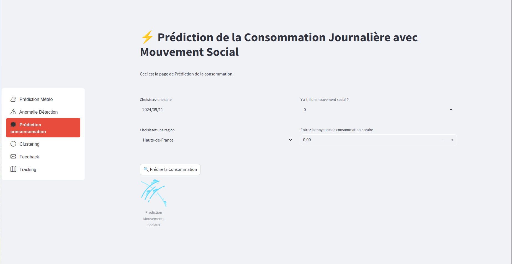
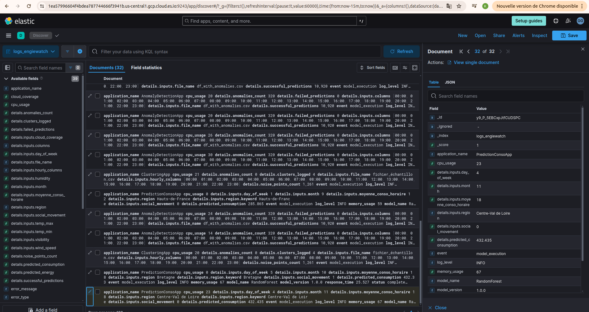
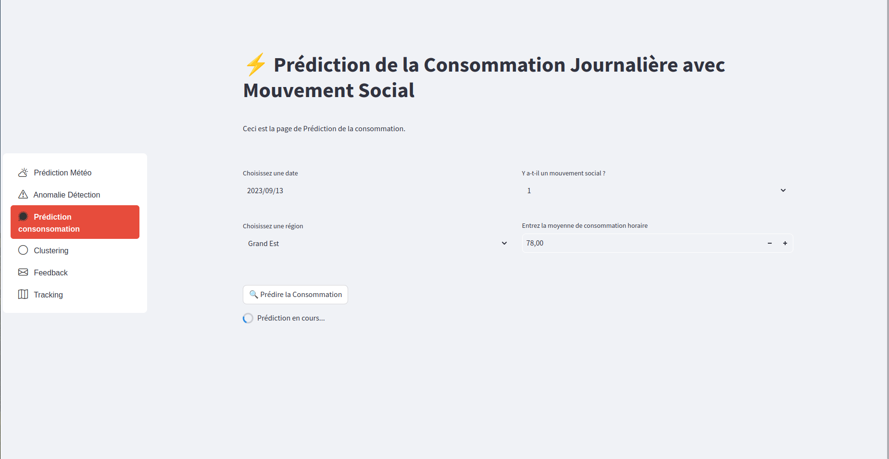
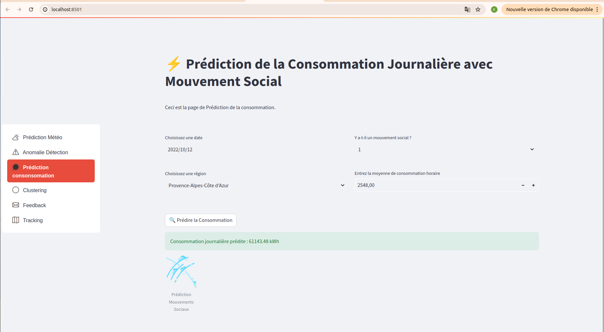

# 📊 Anomaly Detection Dashboard (Streamlit)

### Langage


### Frameworks et Outils de Développement


### Machine Learning & Data Science


### Cloud & Stockage


### Librairies pour les Logs


## 📑 Introduction

Ce projet est le **tableau de bord final** développé avec **Streamlit** qui englobe toutes les fonctionnalités des différents modèles développés dans le cadre de notre projet de **détection d'anomalies**. Ce tableau de bord permet d'interagir avec plusieurs modèles de machine learning et d'observer leurs performances sur différentes tâches.

Cette partie de notre projet de **détection d'anomalies** se concentre sur les aspects suivants :

- 📈 **Détection d'anomalies** pour repérer des comportements anormaux dans les données.
- 🧠 **Clustering** pour grouper les données par région et mieux comprendre les tendances.
- 🔮 **Prédiction de la consommation** d'énergie en prenant en compte les conditions météorologiques et les mouvements sociaux.
- 📝 **Feedback utilisateur** pour améliorer les modèles en continu.
- 🔍 **Suivi des résultats** et des métriques des modèles via **MLflow**.


## 📚 Sommaire

1. [📦 Installation](#installation)
2. [🚀 Lancer l'application](#lancer-lapplication)
3. [📊 Fonctionnalités](#fonctionnalités)
   - [🔍 Détection d'anomalies](#détection-danomalies)
   - [🧠 Clustering](#clustering)
   - [🔮 Prédiction de la consommation en prenant en considération les mouvements sociaux](#prédiction-de-la-consommation)
   - [☁️ Prédiction de la cosommation en prenant en compte les conditions météorologiques](#prédiction-météo)
   - [📝 Feedback utilisateur](#feedback-utilisateur)
   - [📈 Suivi des résultats et des modèles](#suivi-des-résultats-et-des-modèles)
   - [📊 Monitoring et Logs Unifiés](#monitoring-et-logs-unifiés)
4. [📁 Structure du projet](#structure-du-projet)
5. [🖼️ Captures d'écran](#captures-d’écran)


## 📦 Installation <a name="installation"></a>

Avant de commencer, assurez-vous d'avoir **Python 3.9+** et **Docker** installés sur votre machine.

### Étapes d'installation :

1. **Clonez ce dépôt :**

   ```bash
   git clone https://github.com/keagnon/DetectionAnomalie.git
   cd DetectionAnomalie
   ```

2. **Installez les dépendances :**

   ```bash
   pip install -r requirements.txt
   ```

3. **Configuration des variables d'environnement :**

   Créez un fichier `.env` et renseignez les informations de connexion, notamment MongoDB et Elasticsearch :

   ```env
    GOOGLE_APPLICATION_CREDENTIALS=chemin/vers/fichier.json
    MLFLOW_TRACKING_URI=url-de-suivi-mlflow
    MLFLOW_ARTEFACTS_LOCATION=gs://votre-bucket/mlflow_experiment
    AWS_ACCESS_KEY=votre-aws-access-key
    AWS_SECRET_KEY=votre-aws-secret-key
    S3_BUCKET_NAME=bucketfeedbacks
    S3_REGION_NAME=eu-west-3
   ```


## 🚀 Lancer l'application <a name="lancer-lapplication"></a>

### Localement avec Python :

```bash
streamlit run app.py
```

### Avec Docker ⚙️ :

Le projet est entièrement **dockerisé** pour faciliter le déploiement dans différents environnements.

1. **Construisez l'image Docker :**

   ```bash
   docker build -t anomaly-dashboard .
   ```

2. **Exécutez le conteneur Docker :**

   ```bash
   docker run -p 8501:8501 --env-file .env anomaly-dashboard
   ```

Accédez à l'application via [http://localhost:8501](http://localhost:8501).


## 📊 Fonctionnalités <a name="fonctionnalités"></a>

### 🔍 Détection d'anomalies <a name="détection-danomalies"></a>

La section **détection d'anomalies** utilise des modèles comme **Isolation Forest** pour détecter des comportements anormaux dans les données de consommation. Lorsque des données sont chargées via l'interface, un tableau s'affiche avec les données chargées. Les anomalies sont soulignées en <span style="color:red">rouge</span>.


### 🧠 Clustering <a name="clustering"></a>

Dans cette section, nous utilisons des algorithmes de clustering tels que **DBSCAN** et **K-means** pour regrouper les données en clusters distincts. L'utilisateur peut charger des données via notre interface, visualiser les clusters et analyser les tendances.


### 🔮 Prédiction de la consommation prise en compte des mouvements sociaux <a name="prédiction-de-la-consommation"></a>

Cette section permet de tester et de visualiser les résultats de différents modèles de prédiction de la consommation énergétique.



### ☁️ Prédiction de la consommation prise en compte météo <a name="prédiction-météo"></a>

Similaire à la prédiction de la consommation, cette section utilise des modèles pour prédire la consommation en prénant en compte les conditions météorologiques.


### 📝 Feedback utilisateur <a name="feedback-utilisateur"></a>

Cette section permet aux utilisateurs d'envoyer des retours sur les prédictions et les anomalies détectées. Les retours utilisateurs sont stockés dans **Aws** et utilisés pour améliorer les modèles.


### 📈 Suivi des résultats et des modèles <a name="suivi-des-résultats-et-des-modèles"></a>

Le suivi des résultats est effectué avec **MLflow**, qui permet de visualiser les performances des modèles, de comparer les différentes versions, et de suivre l'historique des expériences via une interface dédiée. Au clic sur l'onglet  **Tracking**, vous serez rediriger vers notre serveur Mlflow mis en place pour notre équipe.


## 📊 Monitoring et Logs Unifiés <a name="monitoring-et-logs-unifiés></a>

Dans cette section, nous détaillons le processus de **monitoring** des différentes fonctionnalités de l'application en utilisant **Elasticsearch** et un tableau de bord de suivi. Chaque action (détection d'anomalies, clustering, prédictions, etc.) est loggée dans un format unifié. Les logs sont envoyés à **Elasticsearch** et ensuite visualisés dans un tableau de bord de monitoring.

### Structure des Logs Unifiés

Les logs sont envoyés à **Elasticsearch** avec une structure cohérente pour chaque action. Voici la structure de base d'un log unifié :

```json
{
    "timestamp": "2024-09-17T10:12:34.123Z",
    "event": "model_execution",
    "model_name": "IsolationForest",
    "model_version": "1.0.0",
    "application_name": "AnomalyDetectionApp",
    "response_time": 1.345,
    "log_level": "INFO",
    "status": "completed",
    "cpu_usage": 15.2,
    "memory_usage": 62.5,
    "details": {
        "anomalies_count": 5,
        "noise_points_count": 2,
        "successful_predictions": 10,
        "failed_predictions": 1,
        "inputs": {
            "region": "Île-de-France",
            "social_movement": 1,
            "month": 9,
            "day_of_week": 2
        }
    }
}
```
### Explication des champs de log

- **timestamp** : Le moment où l'action a eu lieu.
- **event** : Le type d'événement enregistré (exemple : `model_execution`).
- **model_name** : Le modèle utilisé pour l'action (exemple : `IsolationForest`).
- **model_version** : La version du modèle utilisé.
- **application_name** : L'application qui génère le log (exemple : `AnomalyDetectionApp`).
- **response_time** : Temps de réponse en secondes pour l'exécution de l'événement.
- **log_level** : Niveau du log (exemple : `INFO` pour succès, `ERROR` pour échec).
- **status** : Statut de l'exécution (`completed` ou `failed`).
- **cpu_usage** et **memory_usage** : Utilisation des ressources système au moment de l'événement.
- **details** : Contient des informations spécifiques à l'événement, comme les **inputs** de l'utilisateur et les résultats de l'exécution.

---

### Explication des logs par type d'événement

- **Détection d'anomalies** : Le log enregistre le nombre d'anomalies détectées, le nombre de prédictions réussies et échouées, ainsi que les entrées spécifiques à l'utilisateur.
- **Clustering** : Le log contient des informations sur le nombre de clusters détectés et les points considérés comme du bruit.
- **Prédiction de consommation énergétique (météo ou mouvements sociaux)** : Chaque log inclut les **inputs** de l'utilisateur, tels que la région, la plage horaire et le mouvement social, ainsi que la consommation énergétique prédite.

Voici une capture d'écran de l'interface d'**Elasticsearch** montrant les logs unifiés et les différents événements enregistrés dans l'application :


### Tableau de Bord de Monitoring

Nous avons mis en place un **tableau de bord** dans **Kibana** pour visualiser les logs en temps réel et suivre les performances des différents modèles. Voici les métriques suivies sur ce tableau de bord :

- **CPU et Mémoire** : Suivi de l'utilisation des ressources système lors des prédictions.
- **Temps de réponse** : Affichage des temps de réponse des différents modèles.
- **Statut des Exécutions** : Nombre de prédictions réussies et échouées.
- **Analyse des Anomalies** : Nombre d'anomalies détectées par région.

Voici une capture d'écran du **tableau de bord Kibana** avec les différentes métriques suivies :


## 📁 Structure du projet <a name="structure-du-projet"></a>

Voici un aperçu de la structure du projet :

```bash
dashboard_ui/
│
├── app.py                      # Point d'entrée principal pour Streamlit
├── Dockerfile                   # Fichier Docker pour le déploiement
├── requirements.txt             # Dépendances Python
├── .env                         # Fichier des variables d'environnement (non inclus dans Git)
├── styles.css                   # Styles CSS pour l'application
│
├── page_anomalie_detection.py    # Page de détection d'anomalies
├── page_clustering.py            # Page de clustering
├── page_feedback.py              # Page pour les retours utilisateur
├── page_prediction_conso.py      # Page pour les prédictions de consommation
├── page_prediction_meteo.py      # Page pour les prédictions météo
├── page_tracking.py              # Page pour le suivi des résultats avec MLflow
├── utils.py                      # Module utilitaire pour les fonctions réutilisables dans l'application
│
├── mlruns/                       # Répertoire de suivi MLflow
└── dashboard_ui_streamlit/        # Fichiers et assets supplémentaires
```


## 🖼️ Captures d'écran <a name="captures-d’écran"></a>

1. **Détection d'anomalies**

   
   
   
   
   
   
   
   

2. **Clustering**

   
   
   
   

3. **Prédiction de la consommation prise en compte des mouvements sociaux**

   
   
   

4. **Prédiction de la consommation prise en compte météo**

   

5. **Feedback utilisateur**

   
   
   
   
   
   

6. **Suivi des résultats**

   
   

7. **Elasticsearch**

   
   

8. **Tableau de Bord des logs avec Kibana**

   


