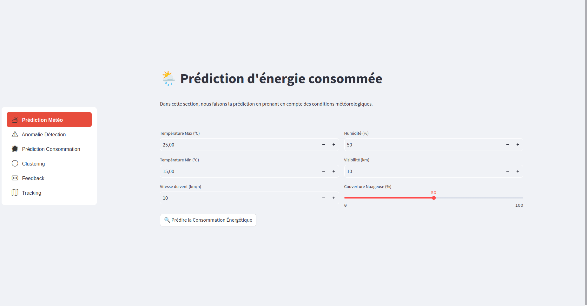
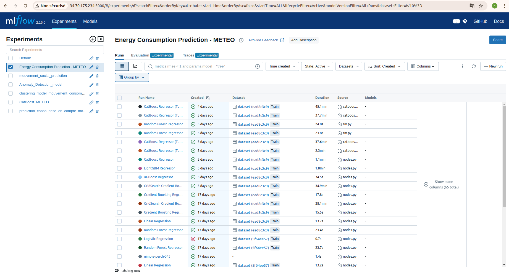
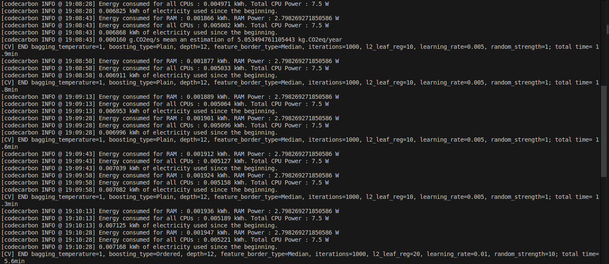

# 🌤️ Détection d'Anomalies dans la Consommation Énergétique Basée sur les Données Météorologiques

## Sommaire
1. [Langage Utilisé](#langage-utilisé)
2. [Frameworks et Outils de Développement](#frameworks-et-outils-de-développement)
3. [Présentation du Projet](#📖-présentation-du-projet)
4. [Installation et Démarrage du Projet](#🛠️-installation-et-démarrage-du-projet)
5. [Structure du Projet](#📂-structure-du-projet)
6. [Fonctionnalités Principales](#🚀-fonctionnalités-principales)
7. [Intégration avec Kedro et Streamlit](#📈-intégration-avec-kedro-et-streamlit)
8. [Modèles et Algorithmes Utilisés](#📊-modèles-et-algorithmes-utilisés)
9. [Intégration avec MLFlow](#📈-intégration-avec-mlflow)
10. [Empreinte Carbone avec CodeCarbon](#🌱-empreinte-carbone-avec-codecarbon)


## Langage Utilisé


## Frameworks et Outils de Développement


## 📖 Présentation du Projet

Ce sous-projet fait partie de la solution globale de **Détection d'Anomalies** dans la consommation d'énergie. Son objectif est de prédire et d'identifier des anomalies dans les comportements de consommation énergétique, en prenant en compte les données météorologiques.

Nous utilisons les algorithmes de **Random Forest** et **CatBoost**, intégrés dans des **pipelines Kedro** pour le traitement des données et l'entraînement des modèles. De plus, une interface interactive, développée avec **Streamlit**, permet de visualiser en temps réel les résultats de ces modèles.


## 🛠️ Installation et Démarrage du Projet

### Prérequis
- Python 3.11+
- Docker (optionnel)
- Accès à Google Cloud Platform (optionnel)

### Étapes d'Installation

1. **Cloner le dépôt :**

    ```bash
    git clone https://github.com/keagnon/DetectionAnomalie.git
    ```

2. **Installer les dépendances :**

    ```bash
    pip install -r requirements.txt
    ```

3. **Configurer l'environnement :**
   - Créez un fichier `.env` à la racine du projet pour stocker vos clés d'API et configurations Google Cloud.

    Exemple de `.env` :

    ```ini
    GCP_STORAGE_BUCKET=my-bucket
    MLFLOW_TRACKING_URI=http://58.36.14.89:5000
    ```

4. **Démarrer MLFlow en local :**

    ```bash
    mlflow ui
    ```

5. **Lancer le projet :**
   Si vous utilisez **Streamlit** pour l'interface utilisateur, exécutez la commande suivante :

    ```bash
    streamlit run streamlit/interface_meteo.py
    ```

---

## 📂 Structure du Projet

```bash
📦 meteo/
├── 📁 conf/                      # Fichiers de configuration
├── 📁 data/                      # Données utilisées dans le projet
│   ├── 📁 01_raw/                # Données brutes
│   ├── 📁 02_intermediate/       # Données intermédiaires
│   ├── 📁 03_primary/            # Données primaires nettoyées
│   ├── 📁 04_feature/            # Features pour les modèles
│   ├── 📁 05_model_input/        # Données prêtes pour les modèles
│   ├── 📁 06_models/             # Modèles d'apprentissage automatique
│   ├── 📁 07_model_output/       # Résultats des modèles
│   └── 📁 08_reporting/          # Rapports et visualisations des résultats
├── 📁 docs/                      # Documentation du projet
├── 📁 MeteoMLFLOW/               # Gestion des expériences ML avec MLFlow
├── 📁 notebooks/                 # Notebooks Jupyter pour l'analyse exploratoire
├── 📁 src/                       # Code source principal
│   ├── 📁 meteo/                 # Code spécifique à la météo
│   │   ├── 📁 pipelines/         # Pipelines de traitement
│   │   │   ├── 📁 data_processing/  # Scripts de traitement des données
│   │   │   ├── 📁 data_science/     # Scripts liés aux modèles
│   │   │   └── 📁 data_viz/         # Scripts de visualisation des données
├── 📁 mlflow-artifacts/          # Artifacts générés par MLFlow
├── 📁 mlruns/                    # Logs et informations sur les runs MLFlow
└── 📁 notebooks/                 # Notebooks d'analyse
```


## 🚀 Fonctionnalités Principales

- **Détection d'anomalies** : Identification des anomalies dans la consommation énergétique à partir de données météorologiques.
- **Modèles utilisés :** Algorithmes de **CatBoost** et **Random Forest** pour la classification et la prédiction des comportements anormaux.
- **Streamlit** : Interface utilisateur interactive permettant la visualisation en temps réel des résultats des modèles.
- **Kedro Pipelines** : Pipelines modulaires pour le traitement de données et l'apprentissage automatique, facilitant la réutilisation et la gestion des workflows complexes.
- **MLFlow** : Suivi complet des modèles de machine learning, y compris la versioning, les métriques et les artefacts.
- **Google Cloud Storage** : Stockage des données et des modèles pour une collaboration efficace et une mise à l'échelle.


## 📈 Intégration avec Kedro et Streamlit

### Kedro Pipelines

Dans notre projet, les pipelines Kedro sont utilisés pour organiser les différentes étapes de traitement des données, l'entraînement des modèles et la génération de rapports. Chaque pipeline a un rôle spécifique et s'intègre dans l'architecture globale du projet.

#### **Structure des Pipelines dans votre Projet**

La structure de nos pipelines, située dans le répertoire `src/meteo/pipelines/`, est organisée comme suit :

```bash
src/meteo/pipelines/
├── data_processing/         # Pipeline pour le traitement et le nettoyage des données
├── data_science/            # Pipeline pour l'entraînement des modèles de machine learning
├── data_viz/                # Pipeline pour la visualisation des données
├── reporting/               # Pipeline pour la génération de rapports
```

#### **Description des Pipelines**

1. **Pipeline `data_processing`** :
   Ce pipeline est chargé du prétraitement des données brutes es données météorologiques et de la consommation journalière. Les tâches typiques incluent le nettoyage des données, la gestion des valeurs manquantes et la transformation des données pour qu'elles soient prêtes à être utilisées par les modèles de machine learning.

2. **Pipeline `data_science`** :
   Ce pipeline est dédié à l'entraînement et à l'évaluation des modèles de machine learning. Il inclut l'intégration des modèles comme **CatBoost** et **Random Forest**. Les résultats des expériences sont enregistrés via **MLFlow** pour permettre un suivi complet des versions des modèles, des métriques, et des configurations d'entraînement. L'empreinte carbone des entraînements est également mesurée via **CodeCarbon** et est stockée pour analyse.

3. **Pipeline `data_viz`** :
   Le pipeline de visualisation génère des graphiques et des tableaux de bord pour une meilleure interprétation des résultats des modèles. Ces visualisations sont souvent utilisées dans l'interface utilisateur **Streamlit** pour permettre une interaction dynamique avec les données et les résultats.

4. **Pipeline `reporting`** :
   Ce pipeline génère des rapports complets sur les performances des modèles, incluant des visualisations des métriques, des comparaisons des résultats et des rapports détaillés sur les différentes itérations des modèles. Ces rapports permettent de suivre les performances et de faciliter la prise de décisions sur le choix des modèles à déployer.


### Interface Utilisateur avec Streamlit

L'application **Streamlit** permet de visualiser les résultats des modèles de manière dynamique et interactive. Les utilisateurs peuvent ajuster divers paramètres et observer les impacts en temps réel sur les prédictions et les visualisations des données.




## 📊 Modèles et Algorithmes Utilisés

- **CatBoost** : Utilisé pour la classification des anomalies énergétiques.
- **Random Forest** : Employé pour la prédiction des comportements anormaux de consommation d'énergie.

## 📈 Intégration avec MLFlow

Nous utilisons **MLFlow** pour gérer l'entraînement et le suivi des modèles, en garantissant une traçabilité complète des expériences.

1. **Enregistrement des modèles :**
   Tous les modèles sont enregistrés avec leurs hyperparamètres, métriques et artefacts.

2. **Suivi des versions :**
   MLFlow gère la versioning des modèles, permettant une comparaison facile des performances entre différentes itérations.

3. **Interface d'accès :**
   Un serveur **MLFlow** est mis en place avec **GCP** pour permettre à l'équipe de suivre et de gérer les modèles de manière centralisée.




## 🌱 Empreinte Carbone avec CodeCarbon

Le projet intègre **CodeCarbon** pour mesurer et réduire l'empreinte carbone générée par l'entraînement des modèles. Cette initiative vise à optimiser la consommation énergétique pendant les phases de calcul intensif, en suivant les émissions via le fichier de métriques généré par CodeCarbon.

Le fichier généré se trouve dans `ml_models/meteo_consommation/meteo/streamlit/emissions.csv`.

